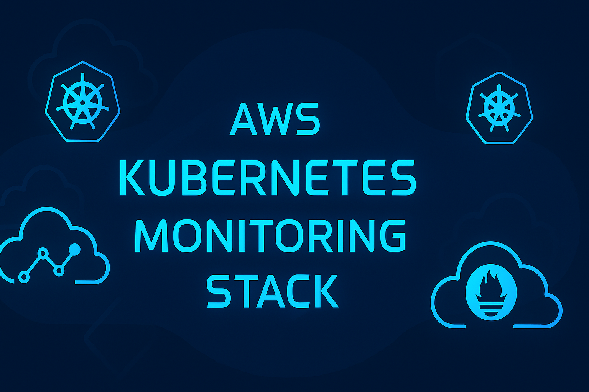
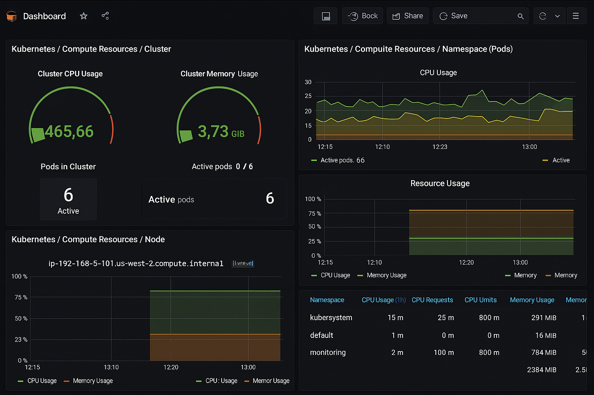
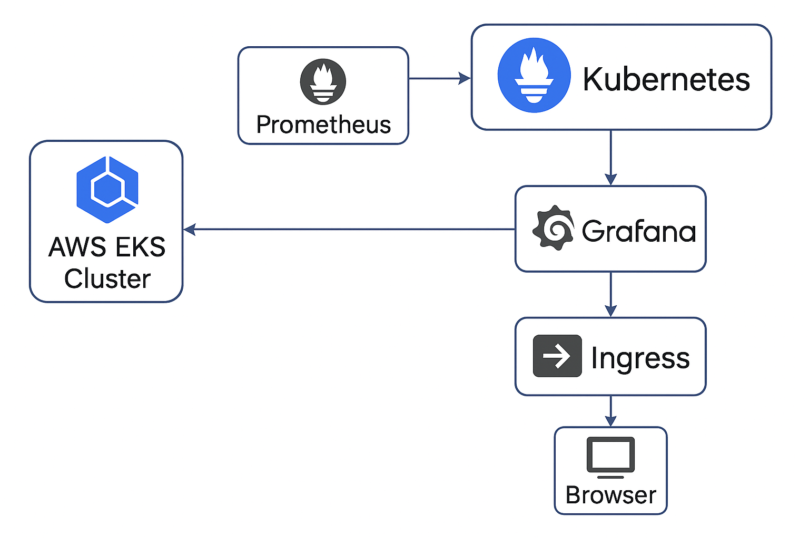

<p align="center">
  
</p>

# AWS Kubernetes Monitoring Stack


This project provisions a full Kubernetes monitoring stack on AWS using Terraform. It deploys Prometheus and Grafana via Helm charts into an EKS cluster, integrates NGINX Ingress, and exposes Grafana with dashboards for monitoring cluster health and performance.

---

## 📸 Screenshots

<p align="center">
  
</p>

---

## 🏗️ Architecture

<p align="center">
  
</p>

---

## 🚀 Features

- EKS Cluster Provisioning using Terraform
- Prometheus and Grafana setup with Helm
- Monitoring for Kubernetes nodes, pods, services
- NGINX Ingress Controller for exposing Grafana
- GitHub Actions CI for Terraform validation and deployment
- Dashboard visualization of real-time metrics

---

## 📦 Project Structure

. ├── assets/ │ ├── banner.png │ ├── grafana-dashboard.png │ └── architecture.png ├── terraform/ │ ├── main.tf │ ├── variables.tf │ ├── outputs.tf │ └── ... ├── .github/workflows/ │ └── terraform.yml └── README.md

yaml
Copy
Edit

---

## 🛠️ Setup

### 1. Clone the Repo

```bash
git clone https://github.com/LMorrison-cyber/aws-k8s-monitoring-stack.git
cd aws-k8s-monitoring-stack
2. Initialize and Apply Terraform
bash
Copy
Edit
cd terraform
terraform init
terraform plan
terraform apply
3. Access Grafana
URL: http://<your-domain-or-ip>/grafana

Default credentials:

User: admin

Password: admin (change after login)

🧰 S3 Workaround for Terraform
Due to GitHub's file size limits, Terraform provider binaries are excluded from version control and stored in an S3 bucket.

To restore Terraform provider files:

bash
Copy
Edit
aws s3 cp --recursive s3://<your-bucket-name>/terraform/.terraform terraform/.terraform
✅ GitHub Actions
This project includes a CI pipeline via GitHub Actions that:

Validates Terraform syntax

Runs terraform plan

Ensures best practices compliance

📌 Requirements
AWS CLI configured

Terraform 1.5+

kubectl

Helm

AWS IAM permissions to manage EKS

🙌 Acknowledgements
Bitnami Helm Charts

Grafana Labs

Prometheus

📣 Connect
Want to see the stack in action?

View project on GitHub

Let’s connect on LinkedIn
